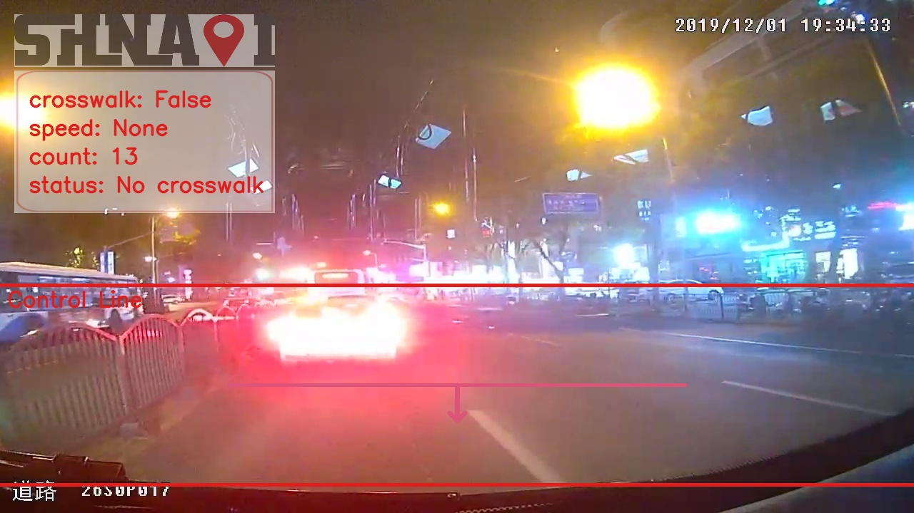
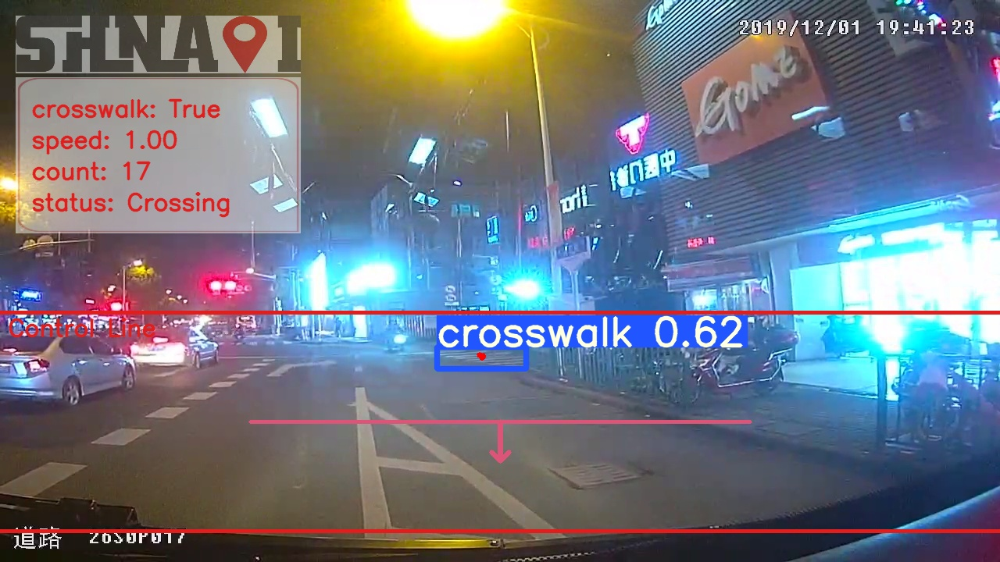
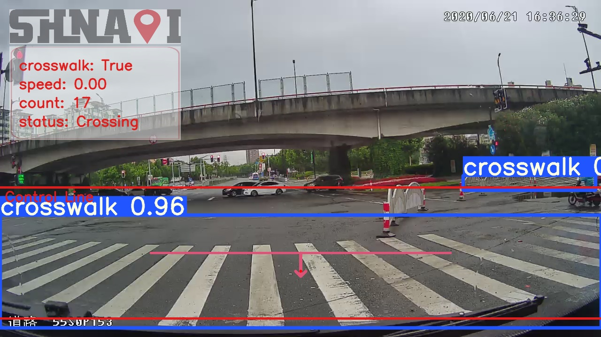

# [实战记录]CDNet代码复现 <!--& Jetson Nano部署小记-->

<!--TOC max2-->

## 背景
<!--
故事要从这里开始讲起，
-->
开发环境：
- 1x RTX A4000
- python 3.10.8, torch 1.13.1, torchaudio 0.13.1, torchvision 0.14.1
- cuda 11.6
- [requirements.txt](https://raw.githubusercontent.com/zhangzhengde0225/CDNet/master/requirements.txt)
<!--
部署环境：
- Jetson Nano 4GB A02
- JetPack 4.6.1
- TensorRT 8.2.1
- cuda 10.2
-->
## 代码复现

### 训练

```
python train.py
```

#### 修改代码

- `requirements.txt`，里的torch, pytorch, torchvision删了，装不了旧的版本，直接用最新的就行了。
（严重怀疑作者压根没用过这个`requirements.txt`，甚至出现了两个torchvision）

- `utils/datasets.py`和`utils/general.py`里有使用`np.int`（已弃用），需要替换成`np.int64`。

- argument在`train.py`里，修改`--trainset_path`和`--device`为自己的path和显卡。

- `train_data_v5_format/labels`下的两个cache要删掉（否则会因为path不一样报KeyError）。

- `utils/general.py`, line 932, `def output_to_target(output, width, height)`
实际传入的output是len=16的list，所以`isinstance(output, torch.Tensor)`会返回`False`。在line 938之后添加一行：

```python linenums="938"
	for i, o in enumerate(output):
		o = o.cpu().numpy() if isinstance(o, torch.Tensor) else o #
```

#### 处理报错

- `ImportError: libGL.so.1: cannot open shared object file: No such file or directory`

cv2导入时缺少libGL.so.1库文件。解决方法：

```
sudo apt install libgl1-mesa-glx
```

- `train.py`, line 229, mac环境会报错。

原因不详。解决方法：换电脑（或者从line 227开始注释）。

### 推理

```
python detect.py --source /root/testsets_1770/Images --output /root/testsets_1770/output
```

#### 修改代码

 - `detect.py`

 line 220, 更改
 ```
 --weights [your path]
 --control-line-setting data/cl_setting.yaml
 ```
 line 255, `opt.weights`

- `scripts/post.py`

line 65, `rect = cv2.imread("settings/rect.jpg")` 改为

```
rect = cv2.imread("data/rect.jpg")
```

找文件夹下的某个文件的path可以用`find`命令

```
find . -name "rect.jpg"
```

- `scripts/post.bak.py`

line 56, `rect = cv2.imread("others/rect.jpg")` 也改为

```
rect = cv2.imread("data/rect.jpg")
```

#### 输出

并没有找到eval metrics，随便po几张。




<!--
## Jetson Nano部署

### 转换TensorRT
-->