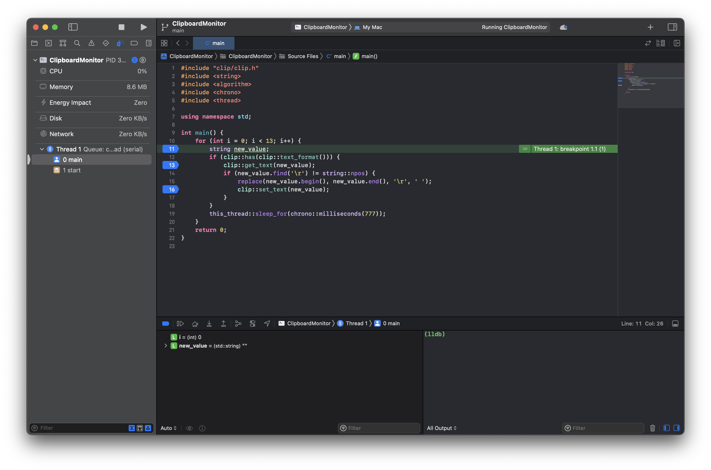
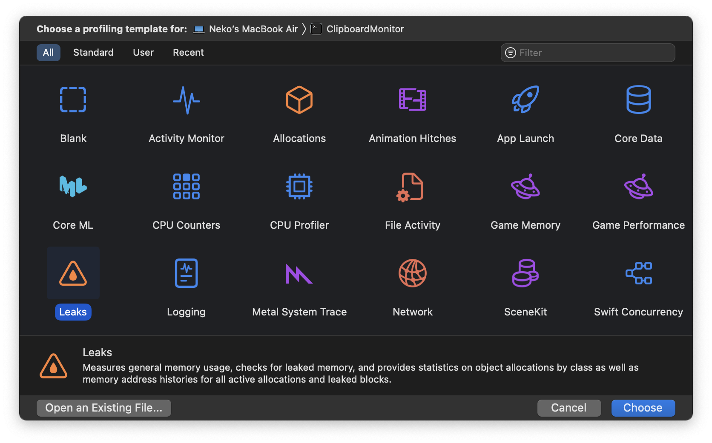
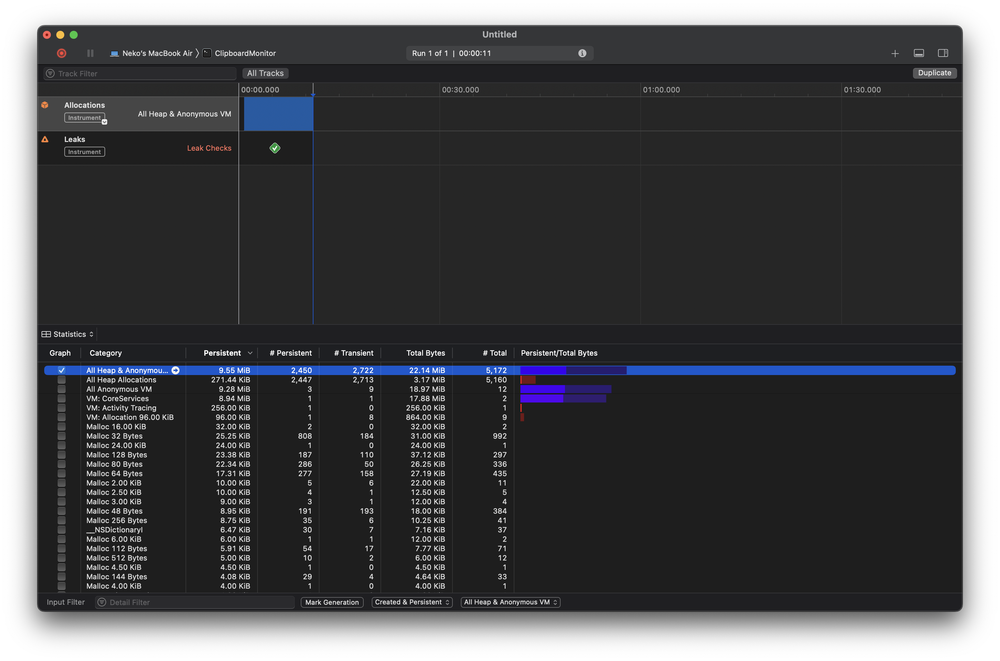
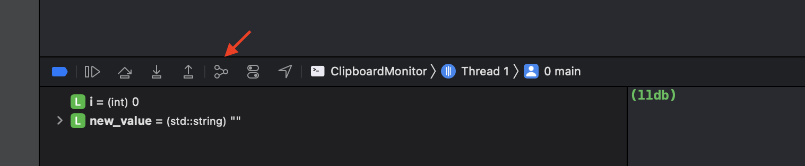
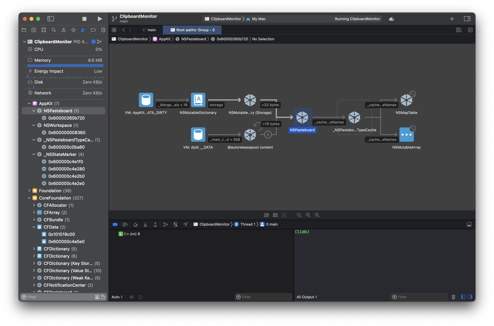
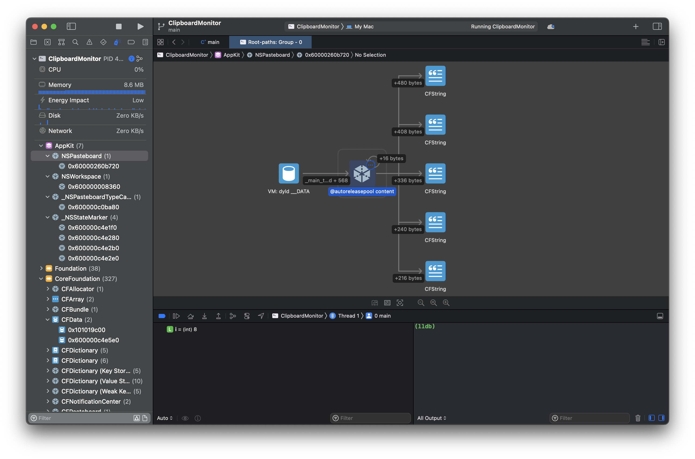

# [踩坑记录]C++开发之Xcode调试小记
*Xcode，这个家不能没有你。*

<!--TOC max2-->

## 背景

故事要从这里开始讲起，从pdf复制文章时往往会遇到莫名其妙的换行问题，虽然有一些解决方案，比如这个[在线转换工具](https://github.com/laorange/paper-assistant)，但还是double了工作量，既不丝滑、也不优雅。而macOS有一个奇妙的feature(bug)，那就是从pdf复制出来的文字是的换行符是`\r`而非`\n`，之前利用这个feature写了C script，再添加进LaunchAgents后台启动，就能非常优雅地监听剪切板并帮我删除换行了。

然而，最近在任务管理器中检查时，发现该进程的内存占用异常地高。在启动时只有3M左右，但使用了一天后就会达到100M以上，这显然是剪贴板的内容并没有被释放，首先怀疑内存泄漏。然后便有了以下的踩坑记录。

开发环境：

- Mac M1 Air, Monterey 12.6.3, Darwin Kernel Version 21.6.0

- Xcode 14.2

- Apple clang version 14.0.0 (clang-1400.0.29.202), cmake 3.25.2

## 预备工作

### 生成Xcode Project

虽然Xcode真的很香，但是没事我肯定不会跳出CLion的舒适圈，就这样跳进了第一个坑。

**坑-1** CLion支持的两个内存泄露检查工具，[valgrind](https://valgrind.org/) 和 [ASan](https://github.com/google/sanitizers/wiki/AddressSanitizer)，都不支持M1 chip。

- 如果不死心的话可以跟着Jetbrain的文档做一下，ASan能装，也能跑，但是传入参数`ASAN_OPTIONS=detect_leaks=1`就会报错。

要重新生成一个Xcode Project很简单，首先把CMakeLists.txt, C++ Script 和用到的 Libraries 都复制在一个新文件夹，然后进入terminal输入
```
cmake . -GXcode
```
等待一会就会出现`.xcodeproj`后缀的文件了，双击点开即可。

## 定位问题

开始Debug之前，先`Command + <`检查一下Build Configuration是`Debug`而不是`Release`。

**坑-2** 先入为主的认定bug出现的原因。

我在debug的时候非常自然的把“剪切板没有释放”和“内存泄漏”划上了等号，导致在寻觅内存泄露检查工具上花了不少的时间，查到最后发现不是我的代码泄露了。

### 断点调试

最基础的debug肯定从breakpoint开始，首先在想要检查的变量的声明、修改处加上断点，然后运行程序，会得到如下界面。

左边是系统资源的占用情况，下边是变量列表和lldb debugger。

#### 用lldb检查变量

在我的极简ClipboardMonitor中，只有一个变量——`new_value`。它会记录剪切板的值并且把`\r`替换成空格，再返还给剪切板。

首先使用lldb检查`new_value`的内容和地址：

```
(lldb) frame var -L new_value
0x000000016fdff450: (std::string) new_value = ""
```

然后进行step over，等变量的值发生变化了再运行一次：

```
(lldb) frame var -L new_value
0x000000016fdff450: (std::string) new_value = "Clipboard copied!"
```

继续step over，在每一个变量发生变化的节点检查值和地址是否如预期一样，很快（在debug的那天并不快）就能得到结论——这串简单的代码不太可能是“内存泄露”的来源。

### 内存泄露检查

其实按上面的结果，应该先去看Memory Graph的。但是debug的时候思路能这么清晰就不叫踩坑记录了，所以我果不其然的先检查Leaks。

`Command + I` 打开Instruments面板。

Xcode的Instruments非常直观，而且有很多预设，其中就包括Leaks。
选择完毕后直接左上角 Start an immediate mode recoding。
当然，我的代码并没有泄露。


### 内存图
在debug界面的下方就能找到`Debug Memory Graph`的图标。

进入

中间的三个按钮分别是跳转到定义、展开当前实例和打印description。

开始debug的时候我随手从浏览器里复制了一串又臭又长的js代码，所以很快就通过内存大小找到了没有释放的对象。



至此，问题已经被成功定位了——clip库调用剪切板时候生成的ObjC不会在每个函数调用完成的时候释放。

<!--BREAK-->

## 解决问题

**坑-3** 不看文档和不用GitHub Issue。

确实是以前面向bug编程的坏习惯，遇到bug非常自然的上手倒腾了。对于不熟悉的语言（Objective-C），不熟悉的内容(Apple API)，以及不是我维护的库。遇到问题应该**先查看有没有文档和类似的Issues**。没有的话提交一个新Issue，能清晰的提出需求，实现和定位到的问题就更好了。

不过这个作者深知他的用户不会读文档，也没写就是了。

12 March 更新： 原作者修好了bug。


看了一下，就是把每一个函数里都套了一层@autoreleasepool。

## 总结

复盘的时候发现了很多可以改进的地方，记录下来也是为了以后不再在奇怪的地方卡住。虽然时候看起来真的很简单，但是思路不清晰的话还是会像这次一样花掉很多时间。

<!--BREAK-->

## 附录 A: ClipboardMonitor源码

```c++
#include "clip/clip.h"
#include <string>
#include <algorithm>
#include <chrono>
#include <thread>

using namespace std;

int main() {
    while (true) {
        string new_value;
        if (clip::has(clip::text_format())) {
            clip::get_text(new_value);
            if (new_value.find('\r') != string::npos) {
                replace(new_value.begin(), new_value.end(), '\r', ' ');
                clip::set_text(new_value);
            }
        }
        this_thread::sleep_for(chrono::milliseconds(777));
    }
    return 0;
}

```

<!--BREAK-->

## 附录 B: lldb常用指令

*lldb有官方的[教程](https://lldb.llvm.org/use/tutorial.html#)，但是在Xcode里lldb只是辅助用的工具，所以只记录最基本的使用方法，并移除和其他debugger功能重复的部分（比如在命令行添加断点）。*

### 命令结构
lldb的命令语法是相当结构化的。所有的命令都遵循以下形式：
```
<noun> <verb> [-options [option-value]] [argument [argument...]]
```
命令行解析在命令执行之前完成，因此它在所有命令中都是统一的。基本命令的命令语法非常简单，参数、选项和选项值都是用空格分隔的，并且使用单引号或双引号（成对）来保护参数中的空格。如果需要在参数中放置反斜杠或双引号字符，则需要在参数中反斜杠它。这使得命令语法更加规范化，但也意味着可能需要在lldb中引用一些参数。

在lldb中还有另一个特殊的引号字符——反引号（`）。例如“len”是一个值为5的int，则命令：

```
(lldb) memory read -c len 0x12345
```
中-c选项的接收值为5，而不是字符串“len”。

### 查看栈帧

检查栈帧参数和局部变量最方便的方法是使用`frame variable`命令：

```
(lldb) frame variable
```

也可以查看某个特定变量的值，例如：

```
(lldb) frame variable foo
(int) foo = 3
```

`frame variable`命令不是full expression parser，但它支持一些简单的操作，如＆，，->，[]（不支持重载运算符）。

`frame variable -o`还将对变量执行"object printing"操作（本质是调用Objective-C的description，Xcode的Memory Graph也有print description的按钮）。

### 查看线程

一旦停止，lldb会选择当前线程（通常是因为某个原因停止的线程）和该线程的当前帧（在停止时这始终是最底部的帧）。许多用于检查状态的命令都是基于当前线程/帧的。

要检查进程的当前状态，可以输入：

```
(lldb) thread list
Process 41864 stopped
* thread #1: tid = 0x12ea18, 0x0000000100003704 ClipboardMonitor`main at main.cpp:19:9, queue = 'com.apple.main-thread', stop reason = step over
  thread #3: tid = 0x12eb89, 0x0000000100217a94 libsystem_pthread.dylib`start_wqthread
  thread #4: tid = 0x14b47a, 0x0000000100217a94 libsystem_pthread.dylib`start_wqthread
  thread #5: tid = 0x14b483, 0x00000001b275c72c libsystem_kernel.dylib`__workq_kernreturn + 8
```

带`*`号的是当前线程。要获得该线程的回溯，可以执行：

```
(lldb) thread backtrace
* thread #1, queue = 'com.apple.main-thread', stop reason = step over
  * frame #0: 0x0000000100003704 ClipboardMonitor`main at main.cpp:19:9
    frame #1: 0x000000010005908c dyld`start + 520
```

或者用缩写`bt`：

```
(lldb) bt
* thread #1, queue = 'com.apple.main-thread', stop reason = step over
  * frame #0: 0x0000000100003704 ClipboardMonitor`main at main.cpp:19:9
    frame #1: 0x000000010005908c dyld`start + 520
```

加上`all`获得所有线程：

输入`(lldb) thread backtrace all `或者 `(lldb) bt all`，返回：

```
* thread #1, queue = 'com.apple.main-thread', stop reason = step over
  * frame #0: 0x0000000100003704 ClipboardMonitor`main at main.cpp:19:9
    frame #1: 0x000000010005908c dyld`start + 520
  thread #3
    frame #0: 0x0000000100217a94 libsystem_pthread.dylib`start_wqthread
  thread #4
    frame #0: 0x0000000100217a94 libsystem_pthread.dylib`start_wqthread
  thread #5
    frame #0: 0x00000001b275c72c libsystem_kernel.dylib`__workq_kernreturn + 8
```

切换线程：

```
(lldb) thread select 5
(lldb) bt all
  thread #1, queue = 'com.apple.main-thread', stop reason = signal SIGSTOP
    frame #0: 0x0000000100003704 ClipboardMonitor`main at main.cpp:19:9
    frame #1: 0x000000010005908c dyld`start + 520
  thread #3
    frame #0: 0x0000000100217a94 libsystem_pthread.dylib`start_wqthread
  thread #4
    frame #0: 0x0000000100217a94 libsystem_pthread.dylib`start_wqthread
* thread #5
  * frame #0: 0x00000001b275c72c libsystem_kernel.dylib`__workq_kernreturn + 8
```

切换frame有两种方法，一种是直接引用：

```
(lldb) frame select 1
```

还有是相对距离：

```
(lldb) frame select -r 1
```

或者使用内置的aliases，官网上说的 “u” 和 “d” ，实测本机上是 “up” 和 “down”。