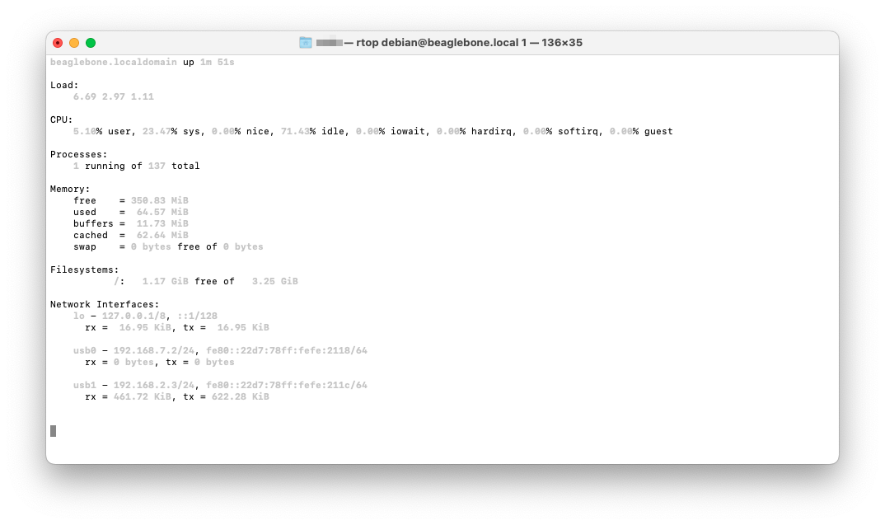
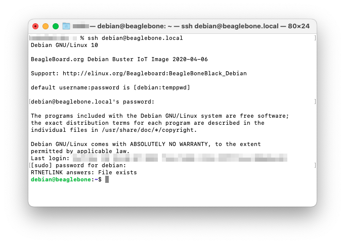

# [实战记录]BeagleBone Green上天记——BBBmini安装之软件篇

<!--TOC max2-->

## 背景

故事要从这里开始讲起。当2023年的我被<a href="https://github.com/mirkix/BBBMINI/">BBBmini</a>吸引而决定实现它的时候，无论是BBG还是BBBmini的官方教程都有些过于陈旧（2019年起几乎没更新）。因此，我决定把此次安装的经验记录下来，以备不时之需（<del>玩坏了回炉重装</del>）。

开发环境：

- Mac M1 Air, Monterey 12.6.3


- 友情支援：ASUS TUF A15 FA506IV, Ubuntu 20.04.5 LTS, AMD Ryzen 7 4800H

硬件组件：

- BeagleBone Green

- 8G microSD卡

- 网线（可选）

## 基本操作

### 调试BBG的两种方法

#### 通过串行口通信

用数据线连接BBG，BBG会自己启动，**过一会**在控制台输入：

```
$ ls /dev/tty.usb*
/dev/tty.usbmodemBBG*********
```

然后通过`screen`连接到串口控制台：

```
screen /dev/tty.usbmodemBBG********* 115200
```

#### 通过ssh连接

用户是`debian`，默认密码是`temppwd`。

```
ssh debian@beaglebone.local
```

需要注意的是，启动sd卡的镜像和烧录进eMMC之后，需要在known_hosts里删除原来的fingerprint：

```
ssh-keygen -R debian@beaglebone.local
```

### 让BBG联网的方法

#### 通过连接的电脑分享网络（以macOS为例）

在`System Preferences > Sharing > Internet Sharing`里可以找到`BeagleBoneGreen`，勾上`BeagleBoneGreen`再勾上`Internet Sharing`。

在BBG的终端输入

```
sudo dhclient usb1
```

#### 通过Ethernet

插网线。

### 实用工具

- [rtop](https://github.com/rapidloop/rtop)：通过ssh实现的remote system monitor。



## 烧录系统

1. 在官网下载最新的Image：[beagleboard.org/latest-images](https://beagleboard.org/latest-images)

> 目前是[AM3358 Debian 10.3 2020-04-06 4GB SD IoT](https://debian.beagleboard.org/images/bone-debian-10.3-iot-armhf-2020-04-06-4gb.img.xz)。

2. 通过balenaEtcher烧录进SD卡。

3. 将SD卡插入BeagleBone然后按住板子下端的USER按钮（Debian的版本够新的话就不用按），启动。



4. 可以用以下指令检查debian版本等信息。

```
$ cat /etc/os-release 
PRETTY_NAME="Debian GNU/Linux 10 (buster)"
NAME="Debian GNU/Linux"
VERSION_ID="10"
VERSION="10 (buster)"
VERSION_CODENAME=buster
ID=debian
HOME_URL="https://www.debian.org/"
SUPPORT_URL="https://www.debian.org/support"
BUG_REPORT_URL="https://bugs.debian.org/"

$ uname -a
Linux beaglebone 4.4.145-bone-rt-r23 #1 PREEMPT RT Tue Jul 31 03:00:02 UTC 2018 armv7l GNU/Linux

$ gcc --version
gcc (Debian 8.3.0-6) 8.3.0
Copyright (C) 2018 Free Software Foundation, Inc. This is free software; see the source for copying conditions. There is NO warranty; not even for MERCHANTABILITY or FITNESS FOR A PARTICULAR PURPOSE.
```

5. 准备把新版本的image写入板载的eMMC。

```
sudo nano /boot/uEnv.txt
```

在`/boot/uEnv.txt`的最后有：

```
##enable Generic eMMC Flasher:
##make sure, these tools are installed: dosfstools rsync
#cmdline=init=/opt/scripts/tools/eMMC/init-eMMC-flasher-v3.sh
```

取消注释：

```
##enable Generic eMMC Flasher:
##make sure, these tools are installed: dosfstools rsync
cmdline=init=/opt/scripts/tools/eMMC/init-eMMC-flasher-v3.sh
```

6. 更新Flasher Scripts：

```
cd /opt/scripts/
git pull
```

7. 重启，等待系统完成烤写，期间指示灯会以0123210的顺序跑马灯，结束后会全灭。下次启动前记得拔掉sd卡。

## 安装环境

扩展分区：

```
sudo /opt/scripts/tools/grow_partition.sh
```

更新并安装依赖：

```
sudo apt-get update
sudo apt-get install -y cpufrequtils g++ gawk git make ti-pru-cgt-installer device-tree-compiler screen python
```

安装RT(Real-time) Kernel：

```
sudo /opt/scripts/tools/update_kernel.sh --bone-rt-kernel --lts-4_1
```

添加BBBMINI DTB：

```
sudo sed -i 's/#dtb=$/dtb=am335x-boneblack-bbbmini.dtb/' /boot/uEnv.txt
```

修改CPU调频策略（保持1GHz）：

```
sudo sed -i 's/GOVERNOR="ondemand"/GOVERNOR="performance"/g' /etc/init.d/cpufrequtils
```

重启。再次连接BBG。

Clone overlays：

```
git clone https://github.com/beagleboard/bb.org-overlays
```

更新DTC(Device Tree Overlays)：

```
cd ./bb.org-overlays
./dtc-overlay.sh
```

安装：

```
./install.sh
```

启用 bone_capemgr 驱动，并启用 ADC(Analog-to-Digital Converter) 设备树覆盖层：

```
sudo sed -i 's/#cape_enable=bone_capemgr.enable_partno=/cape_enable=bone_capemgr.enable_partno=BB-ADC/g' /boot/uEnv.txt
```

重启。再次连接BBG。

## 用 Ubuntu 交叉编译 ArduPilot

### 编译 ArduPilot

**直接在BBG上编译时间远超教程的1h20m，实测的时候跑了6个小时还没跑完。**

1. Clone ArduPilot

```
git clone https://github.com/ardupilot/ardupilot.git
```

2. 安装依赖：

```
cd ardupilot
./Tools/scripts/install-prereqs-ubuntu.sh
```

3. 选择对应的分支

| 应用程序    | 分支名称          | 描述                                            |
|-------------|------------------|-------------------------------------------------|
| ArduCopter  | Copter-3.6.7      | ArduCopter 3.6.7 版本stable分支   |
| ArduPlane   | ArduPlane-3.9.6   | ArduPlane 3.9.6 版本stable分支     |
| ArduPlane   | ArduPlane-beta    | ArduPlane 的beta分支  |
| ArduRover   | Rover-3.5.0       | ArduRover 3.5.0 版本stable分支      |
| ArduSub     | ArduSub-stable    | ArduSub 最新stable分支        |
| ArduSub     | ArduSub-beta      | ArduSub 的beta分支 |

```
git checkout [branch name]
```

4. 编译

```
git submodule update --init --recursive
./waf configure --board=bbbmini
./waf -j16
```


5. 传给BBG。

```
scp build/bbbmini/bin/* debian@beaglebone:/home/debian/
```

### 编译 example/text

```
git checkout master
git submodule update --init --recursive
./waf configure --board=bbbmini
./waf -j16 examples
scp build/bbbmini/examples/* debian@beaglebone:/home/debian/
```

#### IMU

```
sudo /home/debian/INS_generic
```

#### BARO(气压传感器)

```
sudo /home/debian/BARO_generic
```

#### GPS

```
sudo /home/debian/GPS_AUTO_test -B /dev/ttyO5
```

#### RCinput(遥控输入)

```
sudo /home/debian/RCInput
```

## 使用

参数映射:

起始参数 | ArduPilot 串口
-------- | -----------------
-A       | SERIAL0
-B       | SERIAL3
-C       | SERIAL1
-D       | SERIAL2
-E       | SERIAL4
-F       | SERIAL5

查看[这里](http://ardupilot.org/copter/docs/parameters.html#serial0-baud-serial0-baud-rate)以设置 `SERIALx_BAUD` 和 `SERIALx_PROTOCOL` 的正确值。

要连接到 IP 为 `192.168.178.26` 的 MAVLink 地面站，使用参数

 `-C udp:192.168.178.26:14550`

要使用连接到 `UART4` 的电台的 MAVLink，使用参数

 `-C /dev/ttyO4`

如果连接了 GPS 到 `UART5`，使用参数

 `-B /dev/ttyO5`

Example 1: 连接到 IP 为 `192.168.178.26` 的 MAVLink 地面站，端口为 `14550`，并连接 GPS 到 `/dev/ttyO5` 的 `UART5`。

```
sudo /home/debian/arducopter -C udp:192.168.178.26:14550 -B /dev/ttyO5
```


Example 2: 通过连接到 `UART4` 的电台使用 MAVLink，并连接 GPS 到 `/dev/ttyO5` 的 `UART5`。

```
sudo /home/debian/arducopter -B /dev/ttyO5 -C /dev/ttyO4
```